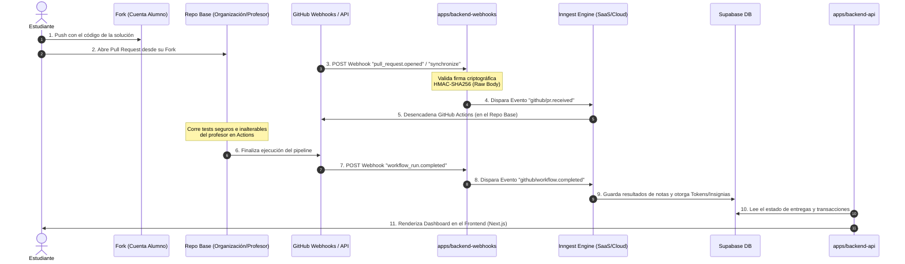

# Documentación Técnica [V1.0.0]

Esta sección detalla las especificaciones de diseño, seguridad y orquestación acordadas para la implementación de la versión 1.0.0 de FragmentsV2.

---

## 1. Diagrama de Arquitectura y Flujos

El siguiente diagrama ilustra el flujo seguro de evaluación basado en Pull Requests y el aislamiento físico de la ingesta de webhooks:



---

## 2. Estructura de Workspaces (Monorrepo con pnpm + Turborepo)

Para mantener la base de código del equipo modular, segura y con despliegues independientes, se adopta la siguiente estructura:

### Aplicaciones (`/apps/`)
*   **`backend-api`**: Servicio Nest.js que maneja la lógica de negocio, autenticación por GitHub OAuth, economía de Slip Days y la API consumida por el panel de profesores y alumnos.
*   **`backend-webhooks`**: Servicio Nest.js ultra-ligero enfocado en el alto rendimiento. Su única responsabilidad es actuar como receptor público de los webhooks de GitHub e Inngest, previniendo que picos de tráfico afecten la experiencia del usuario en el dashboard.
*   **`frontend`**: Aplicación web SPA/SSR desarrollada en Next.js (App Router).
*   **`documentation`**: Sitio estático Docusaurus para centralizar manuales e información del curso (este sitio).

### Paquetes Locales (`/packages/`)
*   **`db`**: Centraliza el cliente de Supabase/Prisma y las migraciones de base de datos para que ambos backends consulten el mismo esquema sin duplicar archivos.
*   **`types`**: Contiene interfaces, DTOs y tipos compartidos para asegurar un tipado estricto extremo desde el frontend hasta la base de datos.
*   **`tsconfig`**: Configuraciones base de TypeScript compartidas para homogeneizar el compilador.

---

## 3. Seguridad y Validación en `backend-webhooks`

El ingestor de webhooks implementa un **Guard criptográfico** estricto para certificar que cada POST proviene legítimamente de GitHub.

### Validación Criptográfica en Tiempo Constante
Para mitigar ataques de temporización (timing attacks), la verificación de la firma del header `X-Hub-Signature-256` se realiza comparando los búferes binarios usando `crypto.timingSafeEqual` sobre el **raw body** de la petición.

```typescript
// apps/backend-webhooks/src/guards/github-webhook.guard.ts
import { Injectable, CanActivate, ExecutionContext, ForbiddenException } from '@nestjs/common';
import * as crypto from 'crypto';

@Injectable()
export class GithubWebhookGuard implements CanActivate {
  canActivate(context: ExecutionContext): boolean {
    const request = context.switchToHttp().getRequest();
    const signature = request.headers['x-hub-signature-256'];
    const rawBody = request.rawBody; // Capturado como Buffer binario en bootstrap (main.ts)
    
    if (!signature || !rawBody) {
      throw new ForbiddenException('Missing signature or body payload');
    }

    const secret = process.env.GITHUB_WEBHOOK_SECRET;
    const hmac = crypto.createHmac('sha256', secret);
    const expectedSignature = 'sha256=' + hmac.update(rawBody).digest('hex');

    const expectedBuffer = Buffer.from(expectedSignature, 'utf8');
    const actualBuffer = Buffer.from(signature, 'utf8');

    if (expectedBuffer.length !== actualBuffer.length || 
        !crypto.timingSafeEqual(expectedBuffer, actualBuffer)) {
      throw new ForbiddenException('Invalid cryptographic signature');
    }

    return true;
  }
}
```

---

## 4. Gestión de Colas y Flujos con Inngest

Para evitar saturar la base de datos de Supabase y esquivar los límites secundarios de abuso de la API de GitHub, delegamos la cola de tareas a **Inngest**.

### Configuración de Concurrencia y Throttling
*   **Concurrencia Limitada:** Máximo de 5 llamadas simultáneas para el procesamiento de webhooks para no ahogar las conexiones del pool de Supabase.
*   **Manejo de Reintentos:** Se aplica una política de reintentos exponencial (exponential backoff) para reaccionar ante interrupciones de red momentáneas de la API de GitHub o de Supabase.
*   **Claves de Concurrencia Dinámica:** Las ejecuciones se encolan agrupadas por la clave `event.data.student_id` para garantizar que un estudiante con múltiples commits rápidos no bloquee el procesamiento del resto de la clase ("noisy neighbor prevention").

---

## 5. Próximos Pasos de Implementación
*   Definición de las reglas de negocio específicas para el canje de Tokens de Tiempo y el otorgamiento automático de Badges (insignias).
*   Diseño de los modelos relacionales de base de datos en Supabase.
*   Modelado de los payloads y configuración de permisos de la GitHub App (Read/Write en Checks y Pull Requests).
